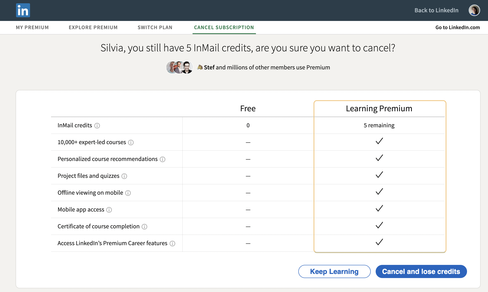
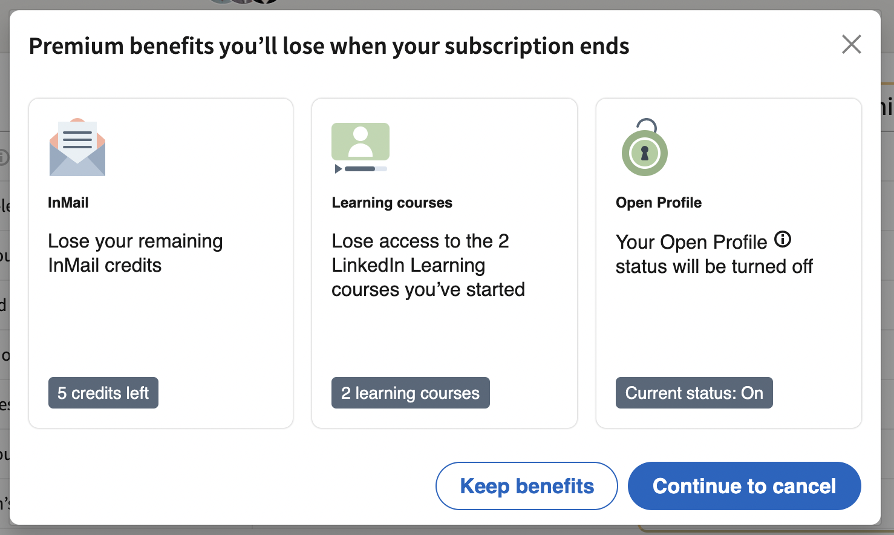

# LinkedIn Confirmshaming

LinkedIn employs a deceptive pattern called [confirm shaming][1] to keep people subscribed to their Premium service.

The label of the button 'Cancel and lose credit' could have been simply been: "Continue to cancel", as the following screenshot shows. 

#DeceptivePattern #ConfirmShaming 

[1]: https://www.deceptive.design/types (Deceptive Patterns)