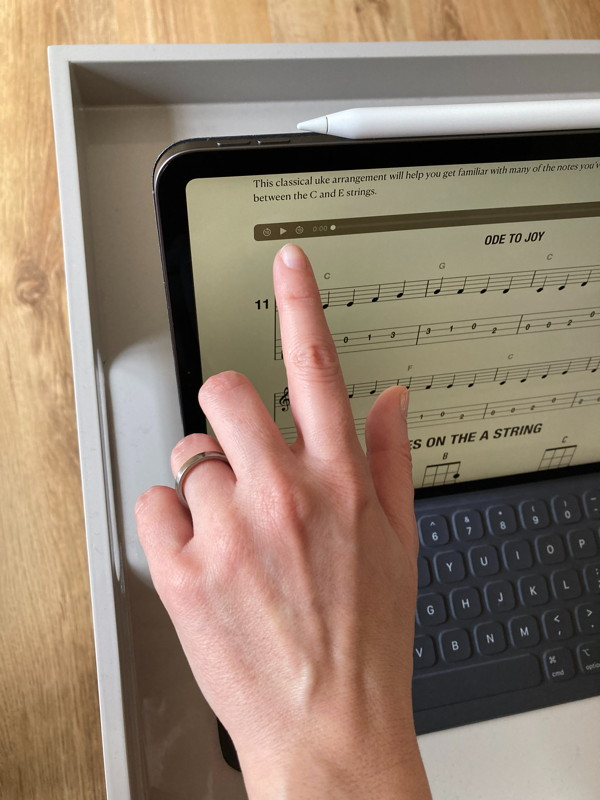
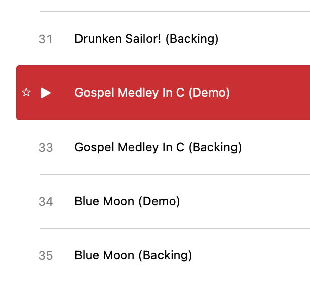

## Apple Books small buttons

I’m practising with my ukulele following an e-book that has audio files. With the iPad on a tea table in front of me, and the ukulele on my lap, I try to play the audio file. Why is the button so small?

I noticed a similar issue on macOS’s Music, where the play button is probably the same size as the Books’, and the only clickable area is the arrow itself.

Given Apple’s many accessibility settings, is this an oversight? Am I not seeing the setting that would help with this issue?

#Accessibility #Usability #UX