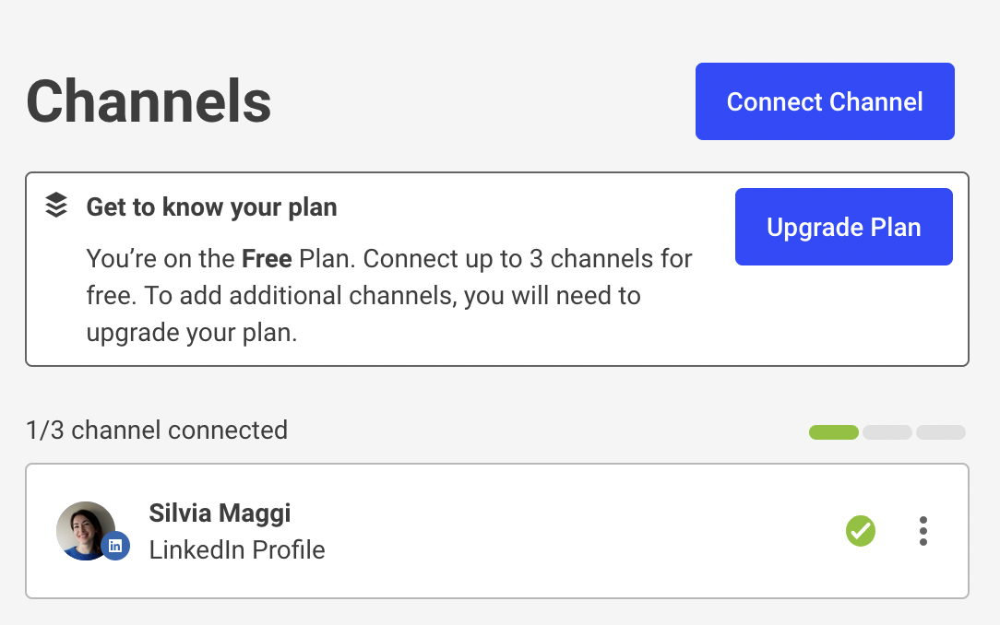
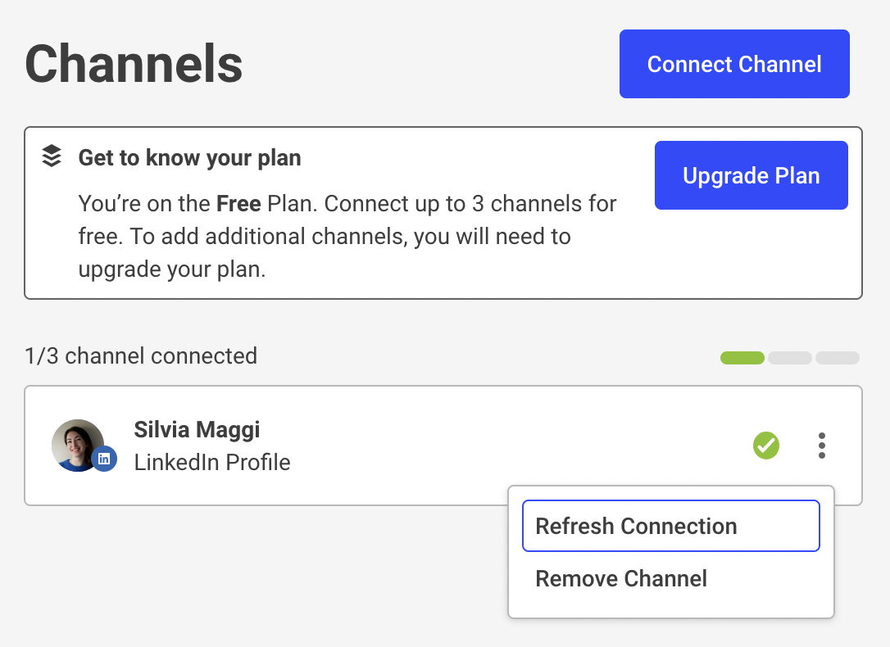

## Invisible action

For reasons I don’t remember, Buffer asked to refresh the connection with LinkedIn before a certain date.

What I expect is to see a button that says "Refresh connection". Instead, I can connect a channel (a new one, probably), and I can upgrade the plan.

The green check in a box containing the LinkedIn connection tells me it’s ok. Near it there’s the dreaded three-vertical-dots icon. 

That’s where it’s possible to refresh the connection. 

## Considerations

This interaction goes into the *could be better UX* category. The experience is not the worst I’ve seen, but I was asked to perform an action in the previous screen that I cannot find at first glance. 

Also, this is on the web interface, so there is space to display the two items within the LinkedIn connection box. Easy to spot, easy to click. Please note that this is **not** about the number of clicks: it’s about visibility and reducing cognitive load.

#UX #Complexity #CognitiveLoad 